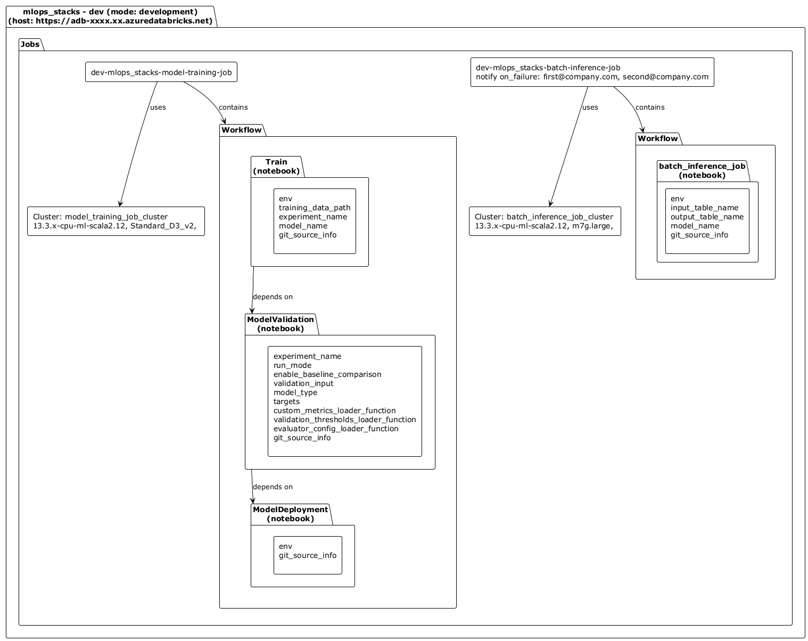
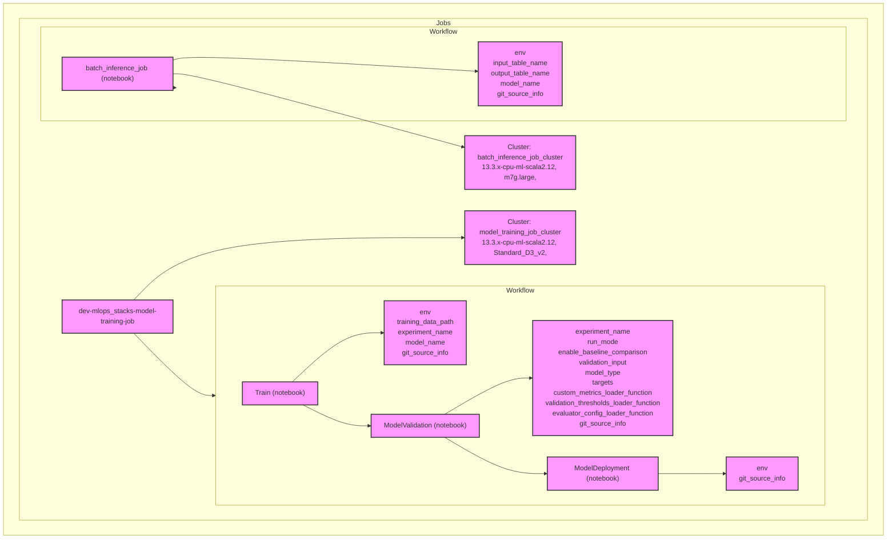

Databricks Asset Bundle Visualizer

# Requirements

Install PlantUML: `choco install plantuml`
Install Mermaid: `npm install -g @mermaid-js/mermaid-cli`

### How to run 

Generate puml and .png files using PlantUML:
`python "src/dabsVisualizer.py" -i "example/databricks.yml" -o "example/dabs_visualization.png" -t plantuml`

Generate mmd files using Mermaid: 
`python "src/dabsVisualizer.py" -i "example/databricks.yml" -o "example/dabs_visualization.png" -t mermaid`
The .mmd files can be inserted directly into markdown and be rendered on i.e. GitHub.

### PlantUML example (exported as .png): 

<!--  -->

### Mermaid example (rendered directly in markdown): 
