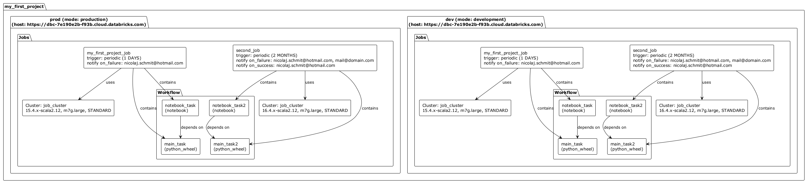
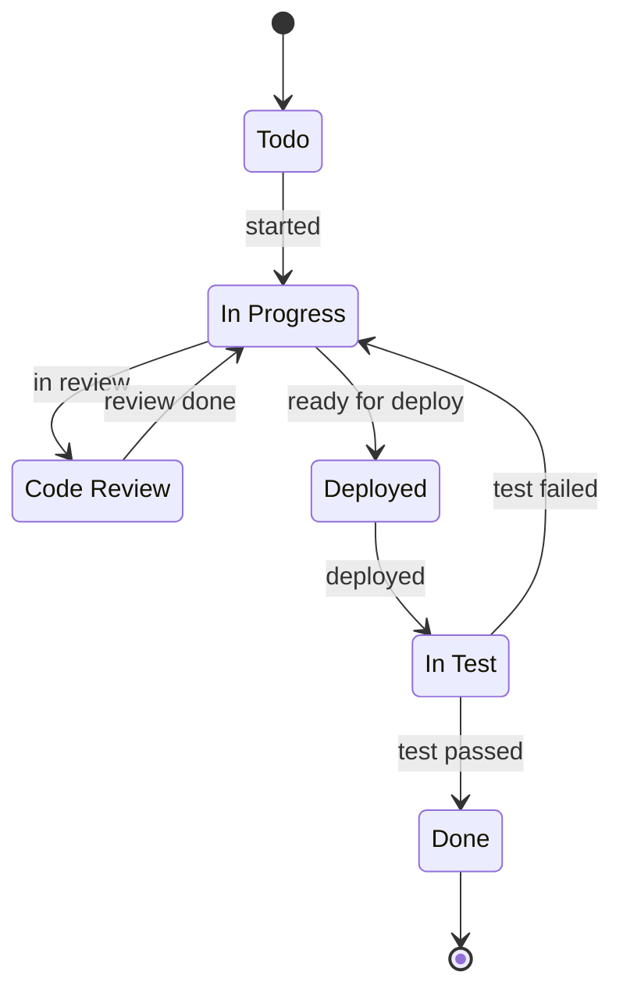

Databricks Asset Bundle Visualizer

### How to run 

`python "src/dabsVisualizer.py" -i "example/databricks.yml" -o "example/dabs_visualization.png"`

### Example 

# mermaid example 

```mermaid 
stateDiagram
    state "Todo" as TODO
    state "In Progress" as IP
    state "Code Review" as CR
    state "Deployed" as DEP
    state "In Test" as TST
    state "Done" as D
    
    [*] --> TODO
    TODO --> IP: started
    IP --> CR: in review
    CR --> IP: review done
    IP --> DEP: ready for deploy
    DEP --> TST: deployed
    TST --> IP: test failed
    TST --> D: test passed
    D --> [*]
```